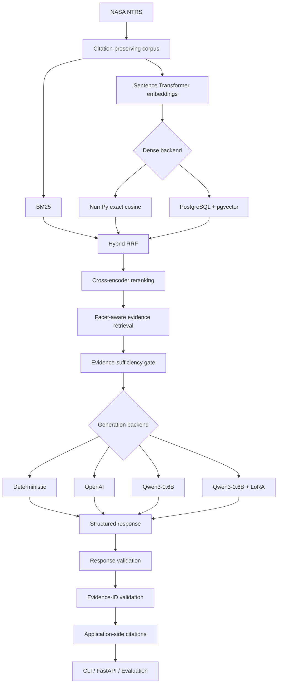

# AeroRAG-X

**An evaluation-first, evidence-grounded retrieval-augmented generation system for aerospace technical knowledge.**

AeroRAG-X is an independent engineering project built around public NASA Technical Reports Server (NTRS) material. It treats corpus construction, retrieval, reranking, grounding, generation, citations, model adaptation, evaluation, and deployment as separately measurable engineering problems.

## Project origin

The idea for AeroRAG-X grew out of questions I became interested in while working on **HERO**, a Georgia Tech Grand Challenge project sponsored by **Delta Air Lines**. AeroRAG-X developed from that interest as an independent project and is not a HERO or Delta Air Lines deliverable.

> **Can a language-model system help navigate aerospace technical literature while making provenance, evidence sufficiency, citations, model behavior, adaptation effects, and failure modes measurable?**

## System architecture



## Current system

### Corpus and provenance
- public NASA NTRS technical material
- **3,233 citation-preserving chunks**
- page/document identifiers and ranges
- source and NASA citation URLs
- source-document checksums
- reproducible manifests

### Retrieval
- BM25
- `sentence-transformers/all-MiniLM-L6-v2` (384 dimensions)
- exact NumPy cosine retrieval
- PostgreSQL + pgvector
- Reciprocal Rank Fusion
- `cross-encoder/ms-marco-MiniLM-L6-v2` reranking
- deterministic facet-aware retrieval

### Grounding
- evidence-sufficiency gating
- unsupported-query rejection before generation
- bounded evidence context
- structured response validation
- evidence-ID validation
- duplicate evidence-reference normalization
- application-side citation resolution

### Generation
- deterministic local provider
- OpenAI structured generation
- Hugging Face Transformers
- `Qwen/Qwen3-0.6B`
- optional PEFT / LoRA adapter

### Serving and operations
- FastAPI
- Docker
- private Google Cloud Run Gen2 validation
- Prometheus
- OpenTelemetry
- structured logging and request IDs
- token / latency / call-bypass telemetry
- GitHub Actions CI

## Retrieval backend comparison

| Metric | NumPy | pgvector |
|---|---:|---:|
| Corpus chunks | 3,233 | 3,233 |
| Embedding dimension | 384 | 384 |
| Exact top-10 matches | 8/8 | 8/8 |
| Recall@10 | 0.277778 | 0.277778 |
| MRR@10 | 0.552083 | 0.552083 |
| NDCG@10 | 0.397576 | 0.397576 |
| Mean local latency | 7.121 ms | 20.517 ms |

At the current corpus size, exact NumPy retrieval remains the simpler and faster default; pgvector is retained for persistence and database-backed workflows.

## PEFT / LoRA adaptation

Training configuration:

```text
Base model: Qwen/Qwen3-0.6B
Training examples: 106
Development examples: 12
Epochs: 3
LoRA rank: 16
LoRA alpha: 32
LoRA dropout: 0.05
Targets: q_proj, k_proj, v_proj, o_proj
Best checkpoint: Epoch 2
```

The adapter weights remain local and are not committed to the repository.

## Why negative results are preserved

The first LoRA + RAG evaluation exposed truncated JSON, supported responses without formal claims, and duplicate evidence references. Those runs were preserved and used to harden structured generation.

The first Base closed-book run also exposed a response-contract issue: five semantic refusal attempts failed strict validation. Raw inspection showed four canonical refusals with explanatory claims and one canonical refusal missing `insufficient_knowledge`. A narrow canonical-refusal normalizer was introduced for v0.2 while preserving the original v0.1 artifacts.

```text
successful training != reliable system behavior
semantic behavior != response-schema compliance
```

## Protected evaluation set

```text
32 queries
20 expected-answerable
12 unsupported controls
```

The protected set is separated from LoRA training.

## Corrected four-way Base / LoRA system study

| Metric | Base closed-book | LoRA closed-book | Base + grounded RAG | LoRA + grounded RAG |
|---|---:|---:|---:|---:|
| Completed | 32/32 | 32/32 | 32/32 | 32/32 |
| Failures | 0 | 0 | 0 | 0 |
| Answerability | 0.7812 | 0.7812 | 1.0000 | 1.0000 |
| Strict unsupported refusal | 0.4167 | 0.4167 | 1.0000 | 1.0000 |
| Expected-term recall | 0.9310 | 0.9310 | 0.9310 | 0.9310 |
| Structural validity | 1.0000 | 1.0000 | 1.0000 | 1.0000 |
| Formal claims | 21 | 33 | 32 | 53 |
| Claims / answerable query | 1.050 | 1.650 | 1.600 | 2.650 |

### Interpretation

- After canonical-refusal normalization, Base and LoRA have the same measured closed-book reliability on this benchmark.
- LoRA increases formal technical decomposition: **21 → 33 claims closed-book (+57.1%)** and **32 → 53 claims with grounded RAG (+65.625%)**.
- The grounded evidence pipeline provides the strongest unsupported-query reliability boundary on this protected set.
- All four conditions have the same `0.9310` lexical expected-term recall, showing that lexical coverage alone cannot distinguish substantially different system behavior.

> **LoRA primarily changes structured technical decomposition; the grounded evidence pipeline provides the stronger reliability boundary.**

## Grounded-generation runtime trade-off

| Metric | Base + RAG | LoRA + RAG |
|---|---:|---:|
| Input tokens | 51,289 | 51,289 |
| Output tokens | 3,314 | 5,182 |
| Total tokens | 54,603 | 56,471 |
| P50 provider latency | 8.88 s | 14.87 s |
| P95 provider latency | 16.08 s | 19.13 s |
| External API cost | $0 | $0 |

Longer output is not treated as automatically better.

## Strict refusal versus semantic behavior

The strict refusal metric counts schema-level refusals and is not a complete hallucination metric. The next evaluation phase separates:

```text
EXPLICIT_REFUSAL
CORRECTIVE_DENIAL
UNSUPPORTED_ASSERTION
STRUCTURAL_FAILURE
```

## Current research direction

The four-way study is complete. The next question is:

> **Does increased formal claim decomposition correspond to better supported technical content?**

Next evaluation targets:
- semantic expected-concept coverage
- claim-evidence entailment
- answer-to-claim completeness
- unsupported-response taxonomy
- redundancy
- targeted human review

Bounded adaptive retrieval follows only after the semantic evaluation layer is established.

## FastAPI

| Method | Endpoint | Purpose |
|---|---|---|
| `GET` | `/health` | process health |
| `GET` | `/ready` | runtime readiness |
| `POST` | `/v1/query` | grounded query |
| `GET` | `/metrics` | Prometheus metrics |
| `GET` | `/docs` | OpenAPI docs |

## Installation

Requires Python 3.12+.

```bash
git clone https://github.com/triasha72/AeroRAG-X.git
cd AeroRAG-X
python -m venv .venv
source .venv/bin/activate
python -m pip install --upgrade pip
python -m pip install -e ".[dev,vector,llm,training]"
```

## Validation

```bash
ruff format --check .
ruff check .
mypy src/aeroragx
pytest -q
```

## Current status

```text
NASA corpus                               DONE
citation-preserving processing            DONE
BM25 / dense / Hybrid RRF                 DONE
cross-encoder reranking                   DONE
evidence sufficiency                      DONE
grounded generation                       DONE
FastAPI / Docker / observability          DONE
private Cloud Run validation              DONE
pgvector                                  DONE
PEFT / LoRA training                      DONE
LoRA failure analysis                     DONE
Base+RAG vs LoRA+RAG evaluation           DONE
closed-book Base / LoRA evaluation        DONE
canonical-refusal normalization           DONE
four-way Base / LoRA system study         DONE

semantic evaluation                       NEXT
bounded adaptive retrieval                PLANNED
adaptive-retrieval evaluation             PLANNED
efficient local inference                 LATER
multimodal technical-report retrieval     FUTURE
```

## License

MIT
