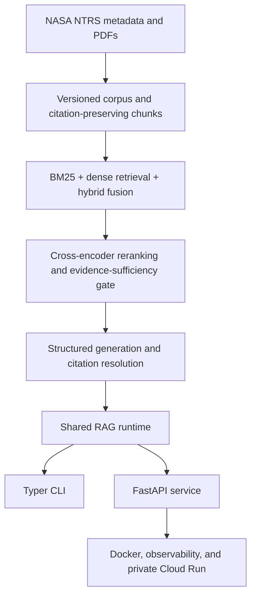

# AeroRAG-X

A production-oriented, evidence-grounded retrieval-augmented generation system for aerospace technical knowledge.

AeroRAG-X is built around a curated NASA Technical Reports Server (NTRS) corpus. It combines reproducible document acquisition, citation-preserving processing, lexical and semantic retrieval, Reciprocal Rank Fusion, cross-encoder reranking, deterministic facet-aware evidence selection, evidence-sufficiency gating, hardened structured generation, authoritative claim-level citation resolution, provider telemetry, FastAPI serving, containerization, observability, and private cloud deployment.

Every generated claim is tied back to retrieved evidence whose document ID, page range, NASA citation URL, source URL, and source-document checksum are preserved through the pipeline.

## System architecture



## Current status

AeroRAG-X implements an end-to-end text RAG system with both CLI and HTTP interfaces.

- Curated NASA NTRS corpus with **3,233 citation-preserving chunks**
- BM25, dense retrieval, Reciprocal Rank Fusion, and cross-encoder reranking
- Deterministic local generation and OpenAI Responses API provider support
- Evidence-sufficiency gating and grounded refusals for unsupported questions
- Claim-level citations resolved from authoritative application-side metadata
- FastAPI API with health, readiness, query, request-ID, and structured-error support
- Non-root Docker service with read-only runtime artifacts
- Structured logs, Prometheus metrics, OpenTelemetry traces, and load validation
- Private Google Cloud Run Gen2 deployment with read-only Cloud Storage artifact mounts

## Project overview

AeroRAG-X is an evidence-grounded retrieval-augmented generation system for aerospace technical knowledge. It explores how reproducible NASA technical-report ingestion, provenance-preserving retrieval, evaluation, and evidence-sufficiency checks can reduce unsupported answers in a high-consequence engineering domain.

The project includes deterministic regression checks and a protected held-out generation-evaluation split, so measured results remain separate from future system tuning.

## Reproducible local demo

Run the complete deterministic local API demonstration:

```bash
./scripts/demo_local.sh
```

## Implemented capabilities

### Corpus acquisition and provenance

- NASA NTRS metadata search
- Reproducible corpus configuration
- Versioned document manifests
- PDF-link resolution
- Streamed PDF acquisition
- Checksum validation and acquisition receipts
- Page-level PDF extraction
- Citation-preserving overlapping chunks
- Document, page, source URL, citation URL, and checksum provenance
- Persistent corpus and embedding manifests

### Retrieval and ranking

- BM25 lexical retrieval
- Sentence Transformer dense retrieval
- Persistent NumPy embedding indexes
- Exact cosine-similarity dense search
- Reciprocal Rank Fusion hybrid retrieval
- Cross-encoder reranking
- Preserved BM25, dense, hybrid, and reranker provenance
- Pooled retrieval evaluation
- Deterministic facet-aware retrieval for supported synthesis patterns

### Grounded generation and safety

- Provider-agnostic generation interface
- Deterministic local generation provider
- OpenAI Responses API structured provider adapter
- Versioned provider and prompt configuration
- Prompt-injection heuristics
- Evidence delimiters and structured-response validation
- Timeout and bounded retry behavior
- Token, latency, retry, request-ID, and estimated-cost telemetry
- Evidence-sufficiency gating before provider invocation
- Numeric-support, named-anchor, and claim-qualifier checks
- Grounded refusal when available evidence is insufficient
- Authoritative application-side citation resolution
- Claim, citation, source-document, and answer schemas

### Evaluation

- Retrieval benchmark v0.1
- Pooled retrieval benchmark v0.2
- Generation v0.3 benchmark with 32 labeled queries
- Deterministic-provider and OpenAI-provider evaluation
- Answerability, refusal, citation, structural-validity, latency, token, and cost metrics
- Frozen evaluation artifacts for reproducibility
- Versioned deterministic baseline and a CI-enforced generation regression policy

### Serving and reliability

- Shared reusable RAG runtime
- FastAPI application factory
- Lifespan-managed one-time runtime loading
- Environment-driven local and OpenAI runtime modes
- `GET /health`
- `GET /ready`
- `POST /v1/query`
- `/docs`, `/redoc`, and `/openapi.json`
- Structured API errors
- Per-request `X-Request-ID`
- Ruff, pytest, strict mypy, coverage, and GitHub Actions
- Dockerized local serving
- Structured JSON logging
- Prometheus metrics at `GET /metrics`
- OpenTelemetry tracing and OTLP/HTTP export
- P50/P95/P99 deterministic load validation

## Generation v0.3 benchmark

The final generation benchmark contains:

| Category | Queries |
|---|---:|
| Expected-answerable queries | 20 |
| Unsupported queries | 12 |
| Total | 32 |

The final configuration uses:

```text
Sufficiency v0.2.1
+ Facet Retrieval v0.1
+ OpenAI Responses API provider
```

### Final generation results

| Metric | Baseline | Final |
|---|---:|---:|
| Answerability accuracy | 0.9375 | 1.0000 |
| Answerable completion | 0.9000 | 1.0000 |
| Unsupported refusal | 1.0000 | 1.0000 |
| Claim citation coverage | 1.0000 | 1.0000 |
| Citation-reference validity | 1.0000 | 1.0000 |
| Expected-term recall | 0.9138 | 0.9310 |
| Structural validity | 1.0000 | 1.0000 |

### Provider-routing results

| Metric | Baseline | Final |
|---|---:|---:|
| Provider calls | 22 | 20 |
| Provider bypasses | 10 | 12 |
| Provider call-policy accuracy | 0.8750 | 1.0000 |
| Total tokens | 63,638 | 58,915 |
| Estimated benchmark cost | $0.105733 | $0.103745 |

Final measured provider latency:

| Metric | Value |
|---|---:|
| P50 provider latency | 5.6394 s |
| P95 provider latency | 7.6947 s |
| Provider retry rate | 0.0 |

The final benchmark produced zero answerability failures.

These results describe the current engineering benchmark only. They are not evidence of universal RAG correctness, general-purpose answer faithfulness, or performance outside the current corpus and evaluation set.

Tracked evaluation artifacts include:

```text
artifacts/evaluation/generation_deterministic_v0_3.json
artifacts/evaluation/generation_deterministic_v0_3_telemetry.json
artifacts/evaluation/generation_openai_v0_3.json
artifacts/evaluation/generation_openai_v0_3_telemetry.json
artifacts/evaluation/generation_openai_v0_3_final.json
artifacts/evaluation/generation_openai_v0_3_final_telemetry.json
artifacts/evaluation/generation_v0_3_final_comparison.json
```

## Held-out deterministic evaluation v0.4

AeroRAG-X also tracks a separate held-out deterministic generation evaluation. Its 12 queries are kept separate from the 32-query development benchmark and were not used to select generation, retrieval, or sufficiency settings.

| Category | Queries |
|---|---:|
| Expected-answerable queries | 6 |
| Unsupported queries | 6 |
| Total | 12 |

The frozen deterministic held-out run used the same retrieval and sufficiency configuration as the development baseline:

```text
generation_v0_1.yaml
sufficiency_v0_2_1.yaml
facet_retrieval_v0_1.yaml
candidate_top_k = 20
evidence_top_k = 5
```

| Metric | Held-out result |
|---|---:|
| Answerability accuracy | 0.9167 |
| Answerable completion | 1.0000 |
| Unsupported refusal | 0.8333 |
| Claim citation coverage | 1.0000 |
| Citation-reference validity | 1.0000 |
| Source-document coverage | 1.0000 |
| Expected-term recall | 0.7778 |
| Structural validity | 1.0000 |

The held-out result is recorded as evidence, not used as a tuning target or a CI regression threshold.

Tracked held-out artifacts:

```text
data/evaluation/generation_queries_v0_4_heldout.jsonl
tests/test_generation_heldout_split.py
artifacts/evaluation/generation_deterministic_v0_4_heldout_baseline.json
```

## Retrieval benchmarks

### Retrieval benchmark v0.1

| Retriever | Recall@5 | Recall@10 | MRR@10 | NDCG@10 |
|---|---:|---:|---:|---:|
| BM25 | 0.7500 | 0.9167 | 0.6771 | 0.7046 |
| Dense | 0.2292 | 0.3958 | 0.3376 | 0.2812 |

The v0.1 judgments were created from a BM25-generated candidate pool, so this comparison can favor BM25.

### Pooled retrieval benchmark v0.2

| Property | Value |
|---|---:|
| Evaluation queries | 8 |
| BM25 depth per query | 20 |
| Dense depth per query | 20 |
| Candidates after deduplication | 278 |
| Relevant labels | 101 |
| Non-relevant labels | 177 |
| Shuffle seed | 42 |
| Corpus size | 3,233 chunks |

| Retriever | Recall@5 | Recall@10 | MRR@10 | NDCG@10 |
|---|---:|---:|---:|---:|
| BM25 | 0.2662 | 0.4016 | 0.7292 | 0.5321 |
| Dense | 0.1330 | 0.2778 | 0.5521 | 0.3976 |
| Hybrid RRF | 0.2043 | 0.3024 | 0.7639 | 0.4777 |
| Reranker top-10 | 0.2087 | 0.3024 | 0.7188 | 0.4614 |
| Reranker top-20 | 0.2068 | 0.3375 | 0.8375 | 0.5080 |

Current reranker:

```text
cross-encoder/ms-marco-MiniLM-L6-v2
```

Current scoring-only CPU baseline:

| Field | Value |
|---|---:|
| Queries | 8 |
| Query-chunk pairs | 160 |
| Total scoring time | 3.170787 s |
| Milliseconds per pair | 19.817420 ms |
| Hardware | MacBook Air CPU baseline |

## FastAPI service

AeroRAG-X exposes the same grounded-generation runtime through a FastAPI service.

The heavy retrieval and generation runtime is constructed once during application startup and reused across requests.

| Method | Endpoint | Purpose |
|---|---|---|
| `GET` | `/health` | Process health check |
| `GET` | `/ready` | RAG runtime readiness |
| `POST` | `/v1/query` | Generate one evidence-grounded answer |
| `GET` | `/metrics` | Prometheus metrics |
| `GET` | `/docs` | Interactive Swagger/OpenAPI documentation |
| `GET` | `/redoc` | ReDoc documentation |
| `GET` | `/openapi.json` | OpenAPI schema |

### Runtime environment

```text
AERORAGX_RUNTIME_MODE
AERORAGX_CANDIDATE_TOP_K
AERORAGX_EVIDENCE_TOP_K
```

Supported runtime modes:

```text
local
openai
```

### Local deterministic mode

Local mode runs the full retrieval, reranking, facet-selection, sufficiency, citation-resolution, and HTTP path without an external LLM call.

In Terminal 1:

```bash
unset OPENAI_API_KEY

export AERORAGX_RUNTIME_MODE=local
export AERORAGX_CANDIDATE_TOP_K=20
export AERORAGX_EVIDENCE_TOP_K=5

python -m uvicorn \
  aeroragx.api:app \
  --host 127.0.0.1 \
  --port 8000
```

In Terminal 2:

```bash
curl -sS http://127.0.0.1:8000/health
echo

curl -sS http://127.0.0.1:8000/ready
echo
```

Example grounded query:

```bash
curl -sS \
  -X POST \
  http://127.0.0.1:8000/v1/query \
  -H "Content-Type: application/json" \
  -d '{
    "query": "Why is cryogenic hydrogen storage challenging for aircraft?"
  }'
```

### OpenAI-backed mode

The same service can use the configured OpenAI Responses API provider without changing application code.

```bash
export AERORAGX_RUNTIME_MODE=openai
export AERORAGX_CANDIDATE_TOP_K=20
export AERORAGX_EVIDENCE_TOP_K=5
export OPENAI_API_KEY="your-key"
```

Do not commit API keys. After a local live test:

```bash
unset OPENAI_API_KEY
export AERORAGX_RUNTIME_MODE=local
```

OpenAI execution uses:

```text
configs/generation_openai_v0_1.yaml
configs/provider_v0_1.yaml
configs/http_transport_openai_v0_1.yaml
configs/provider_runtime_openai_v0_1.yaml
configs/sufficiency_v0_2_1.yaml
configs/facet_retrieval_v0_1.yaml
```

## Request IDs and structured errors

Every HTTP request receives an AeroRAG-X request identifier.

Responses include:

```text
X-Request-ID: <uuid>
```

Structured errors include the same request ID:

```json
{
  "error": {
    "code": "invalid_request",
    "message": "Request validation failed.",
    "request_id": "<same UUID as X-Request-ID>"
  }
}
```

| HTTP status | Error code | Meaning |
|---:|---|---|
| 422 | `invalid_request` | Request-schema validation failure |
| 502 | `provider_failure` | Structured generation-provider failure |
| 503 | `runtime_unavailable` | RAG runtime is unavailable |
| 500 | `internal_error` | Unexpected internal failure |

Provider and internal exception details are not exposed directly to clients.

## Provider telemetry and trust boundary

When a structured external provider is invoked, `retrieval_metadata.provider_telemetry` can include:

- provider request ID
- model name
- attempt count
- latency
- input tokens
- output tokens
- estimated cost
- prompt-injection assessment
- success or failure state

If the evidence-sufficiency gate rejects a request before provider invocation, provider telemetry remains `null`.

Retrieved evidence is treated as untrusted input. The provider is not trusted to create authoritative citation metadata.

The provider may return:

```text
claim -> evidence ID
```

AeroRAG-X resolves each evidence ID to authoritative retrieved metadata. Final citations preserve:

```text
citation_id
evidence_id
chunk_id
document_id
page_start
page_end
citation_url
source_url
document_sha256
reranker_rank
```

Unknown evidence references are rejected.

## Evidence-sufficiency gate

Primary implementation:

```text
src/aeroragx/generation/sufficiency.py
```

Current configuration:

```text
configs/sufficiency_v0_2_1.yaml
```

The gate checks:

- minimum evidence count
- informative query-term coverage
- minimum supported terms
- single-evidence coverage
- numeric support
- named-anchor support
- claim-qualifier support
- stricter coverage for exact-value questions

The full decision is preserved in retrieval metadata for auditable provider bypasses and refusals.

## Facet-aware retrieval

Primary implementation:

```text
src/aeroragx/generation/facet_retrieval.py
```

Configuration:

```text
configs/facet_retrieval_v0_1.yaml
```

For recognized multi-facet synthesis patterns, the wrapper:

- derives deterministic facet searches;
- retrieves evidence for each facet;
- verifies semantic facet identity;
- deduplicates by `chunk_id`;
- balances evidence across supported facets;
- adds original-query evidence;
- falls back to ordinary retrieval if semantic facet support is unavailable.

The current implementation is intentionally narrow rather than a general-purpose query-planning agent.

## Installation

AeroRAG-X requires Python 3.12 or newer.

```bash
git clone https://github.com/triasha72/AeroRAG-X.git
cd AeroRAG-X

python -m venv .venv
source .venv/bin/activate

python -m pip install --upgrade pip
python -m pip install -e ".[dev]"
```

Conda is also supported:

```bash
conda create -n aeroragx-py312 python=3.12
conda activate aeroragx-py312
python -m pip install -e ".[dev]"
```

Check the CLI:

```bash
aeroragx --help
```

## Important CLI workflows

### Cross-encoder reranking

```bash
aeroragx ntrs-reranker-search \
  --query "battery thermal runaway" \
  --candidate-top-k 20 \
  --top-k 10
```

### Deterministic grounded answer

```bash
aeroragx ntrs-grounded-answer \
  --query "How can battery thermal runaway propagate in electric aircraft?" \
  --candidate-top-k 20 \
  --evidence-top-k 5 \
  --generation-config configs/generation_v0_1.yaml \
  --sufficiency-config configs/sufficiency_v0_2_1.yaml
```

### OpenAI grounded answer with facet-aware retrieval

```bash
aeroragx ntrs-grounded-answer \
  --query "What thermal-management challenges are shared by battery-electric and fuel-cell aircraft?" \
  --candidate-top-k 20 \
  --evidence-top-k 5 \
  --generation-config configs/generation_openai_v0_1.yaml \
  --provider-config configs/provider_v0_1.yaml \
  --http-transport-config configs/http_transport_openai_v0_1.yaml \
  --provider-runtime-config configs/provider_runtime_openai_v0_1.yaml \
  --sufficiency-config configs/sufficiency_v0_2_1.yaml \
  --facet-retrieval-config configs/facet_retrieval_v0_1.yaml
```

## Dockerized local service

AeroRAG-X can run the FastAPI serving layer inside a non-root Docker container.

The local image uses CPU-only PyTorch and does not require CUDA.

Build the image:

```bash
docker build \
  -t aeroragx:local \
  .
```

Generated NASA corpus and dense embedding artifacts are intentionally not baked into the image. They are mounted read-only when the service starts:

```bash
docker run \
  -d \
  --name aeroragx-local \
  -p 8000:8000 \
  -e AERORAGX_RUNTIME_MODE=local \
  -e AERORAGX_CANDIDATE_TOP_K=20 \
  -e AERORAGX_EVIDENCE_TOP_K=5 \
  -v "$PWD/data/processed:/app/data/processed:ro" \
  -v "$PWD/artifacts/embeddings:/app/artifacts/embeddings:ro" \
  aeroragx:local
```

Run the reproducible integration smoke test:

```bash
./scripts/docker_smoke.sh
```

The smoke test validates required runtime artifacts, container startup, health and readiness, non-root execution, mounted NASA artifacts, a grounded query, returned claims and citations, deterministic local generation, and `X-Request-ID`.

See [docs/docker.md](docs/docker.md) for the complete Docker workflow.

## Production observability and reliability

Phase 13 adds production-oriented observability around the FastAPI and Docker serving path:

- structured JSON logs;
- request, provider, trace, and span correlation;
- runtime, HTTP, RAG, retrieval, reranker, facet, and provider timings;
- Prometheus metrics at `GET /metrics`;
- deterministic P50/P95/P99 load validation;
- OpenTelemetry FastAPI and application spans;
- OTLP/HTTP trace export;
- local OpenTelemetry Collector validation;
- privacy controls that exclude raw query and evidence text from observability payloads.

Local deterministic load validation completed with zero failures through concurrency 4.

| Metric | Value |
|---|---:|
| Requests | 20 |
| Concurrency | 4 |
| P50 latency | 993.928 ms |
| P95 latency | 1117.138 ms |
| P99 latency | 1126.538 ms |
| Throughput | 3.966 requests/s |

See [docs/observability.md](docs/observability.md) for logging, metrics, tracing, load testing, privacy, and failure-mode details.

## Private Cloud Run deployment

AeroRAG-X is deployed as a private Google Cloud Run Gen2 service.

The deployment uses:

- an immutable Artifact Registry image digest;
- port `8000`;
- two CPU cores and 2 GiB memory;
- concurrency of one;
- zero minimum instances and one maximum instance;
- a 300-second request timeout;
- a dedicated runtime service account;
- two read-only Cloud Storage volume mounts;
- authenticated invocation only.

The mounted runtime artifact layout is:

| Container path | Contents |
|---|---|
| `/app/data/processed` | NASA corpus chunks |
| `/app/artifacts/embeddings` | embedding matrix, metadata, and manifest |

The Cloud Run runtime service account has bucket-scoped `roles/storage.objectViewer` access only. The service is private: unauthenticated access is disabled.

Authenticated live validation passed for:

```text
GET  /health
GET  /ready
POST /v1/query
```

See [docs/cloud-run.md](docs/cloud-run.md) for deployment, validation, rollback, and security details.

## Validation

Run the local quality gate:

```bash
python -m ruff format --check .
python -m ruff check .
python -m pytest -q
python -m mypy src/aeroragx
git diff --check
```

CI runs the same core quality checks on pull requests.

## Repository structure

```text
AeroRAG-X/
├── .github/
│   └── workflows/
├── artifacts/
├── configs/
├── data/
├── docs/
│   ├── api.md
│   ├── architecture.md
│   ├── cloud-run.md
│   ├── demo.md
│   ├── docker.md
│   ├── evaluation.md
│   ├── generation.md
│   └── observability.md
├── scripts/
│   ├── demo_local.sh
│   └── docker_smoke.sh
├── src/
│   └── aeroragx/
│       ├── api/
│       ├── generation/
│       ├── ingestion/
│       ├── processing/
│       ├── retrieval/
│       └── runtime.py
├── tests/
├── LICENSE
├── README.md
├── ROADMAP.md
└── pyproject.toml
```

## Documentation

- [docs/architecture.md](docs/architecture.md) — architecture, trust boundaries, runtime composition, and failure behavior
- [docs/api.md](docs/api.md) — FastAPI endpoints, environment configuration, request IDs, errors, and smoke tests
- [docs/docker.md](docs/docker.md) — Docker build, CPU runtime, read-only artifact mounts, health checks, and container smoke testing
- [docs/observability.md](docs/observability.md) — logging, metrics, tracing, load testing, privacy, and failure modes
- [docs/cloud-run.md](docs/cloud-run.md) — private Cloud Run deployment, Cloud Storage mounts, validation, rollback, and operational limits
- [docs/demo.md](docs/demo.md) — reproducible deterministic local API demonstration
- [docs/generation.md](docs/generation.md) — grounded generation and provider behavior
- [docs/evaluation.md](docs/evaluation.md) — retrieval and generation evaluation
- [ROADMAP.md](ROADMAP.md) — completed milestones and planned phases

## Security and limitations

AeroRAG-X currently:

- treats retrieved text as untrusted provider input;
- uses deterministic prompt-injection heuristics;
- validates structured provider output;
- rejects unknown evidence IDs;
- resolves citation metadata application-side;
- redacts provider secrets from transport errors;
- refuses unsupported questions before provider invocation when possible;
- keeps API keys in environment variables rather than tracked configuration;
- runs the Docker service as a non-root user;
- mounts generated serving artifacts read-only;
- uses a least-privilege Cloud Run runtime service account;
- keeps the deployed Cloud Run API private.

Current non-goals include:

- autonomous general-purpose agents;
- semantic entailment verification;
- table and figure retrieval;
- managed secret storage for cloud-hosted external-provider credentials;
- public unauthenticated API access;
- public API rate limiting and abuse controls;
- persistent vector-database serving.

## Release status

Version 0.1.0 freezes a validated text-RAG baseline with reproducible local execution, deterministic regression checks, a protected held-out generation-evaluation split, containerized serving, observability, and private Cloud Run validation.

Future work will prioritize measuring known failure modes—especially retrieval coverage, citation support, and answer faithfulness—before adding new infrastructure or model features.

See [ROADMAP.md](ROADMAP.md) for the planned sequence.