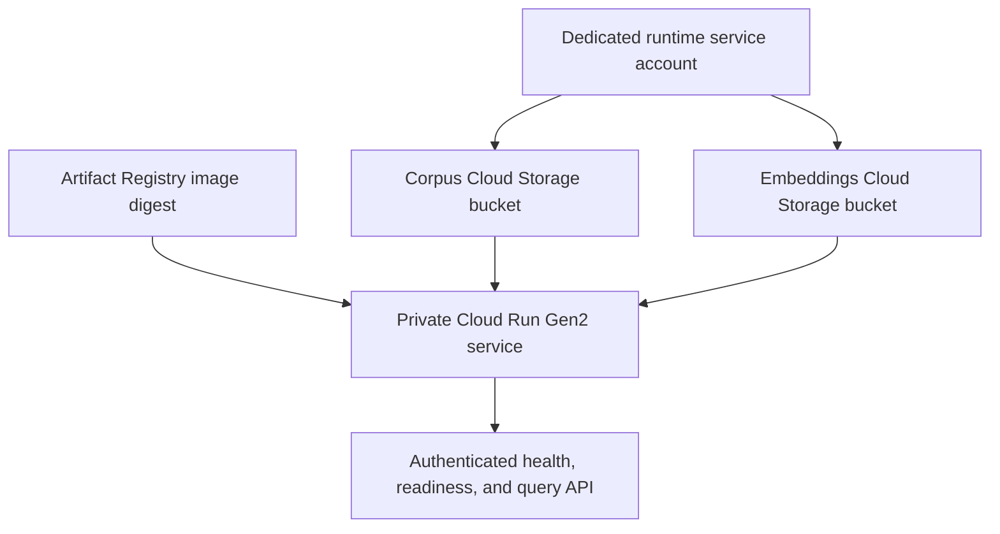

# Private Cloud Run Deployment

## Purpose

This document describes the private Google Cloud Run deployment for AeroRAG-X.

The deployment reuses the existing Dockerized FastAPI service and mounts runtime artifacts directly from Google Cloud Storage. The service remains private and is invoked only by authenticated principals.

## Deployment architecture



The service uses:

- Cloud Run Gen2
- FastAPI on port `8000`
- two CPU cores
- 2 GiB memory
- concurrency of one
- zero minimum instances
- one maximum instance
- 300-second request timeout
- an immutable Artifact Registry image reference
- authenticated invocation only

## Runtime artifact layout

AeroRAG-X expects the following paths inside the container:

| Container path | Required artifact |
|---|---|
| `/app/data/processed/ntrs/v0_1/chunks.jsonl` | Citation-preserving corpus chunks |
| `/app/artifacts/embeddings/ntrs_v0_1.npy` | Dense embedding matrix |
| `/app/artifacts/embeddings/ntrs_v0_1_metadata.jsonl` | Aligned embedding metadata |
| `/app/artifacts/embeddings/ntrs_v0_1_manifest.json` | Embedding manifest |

Cloud Run mounts two Cloud Storage buckets at the parent directories:

| Cloud Storage bucket | Container mount path | Access |
|---|---|---|
| Corpus bucket | `/app/data/processed` | Read-only |
| Embeddings bucket | `/app/artifacts/embeddings` | Read-only |

This matches the same filesystem contract used by the local Docker workflow.

## Security model

The deployment uses a dedicated runtime service account.

The runtime service account:

- has `roles/storage.objectViewer` on the corpus bucket;
- has `roles/storage.objectViewer` on the embeddings bucket;
- cannot write, delete, or modify the serving artifacts;
- does not require a downloaded service-account key.

The Cloud Run service:

- runs privately;
- disables unauthenticated invocation;
- accepts requests from principals granted `roles/run.invoker`;
- uses read-only Cloud Storage volume mounts;
- does not store API keys in the repository or container image.

## Prerequisites

Before deploying, ensure that:

- Google Cloud CLI is installed and authenticated;
- the Artifact Registry image exists;
- both Cloud Storage buckets exist;
- all runtime artifacts have been uploaded;
- cloud copies have been verified;
- the Cloud Run runtime service account exists;
- the runtime service account has `roles/storage.objectViewer` on both buckets;
- the Cloud Run API is enabled.

## Environment variables

Set deployment values in your terminal:

```bash
export PROJECT_ID="your-project-id"
export REGION="us-east1"

export SERVICE_NAME="aeroragx-api"
export SERVICE_ACCOUNT_NAME="aeroragx-runtime"
export SERVICE_ACCOUNT_EMAIL="${SERVICE_ACCOUNT_NAME}@${PROJECT_ID}.iam.gserviceaccount.com"

export CORPUS_BUCKET="your-corpus-bucket"
export EMBEDDINGS_BUCKET="your-embeddings-bucket"

export IMAGE_BY_DIGEST="us-east1-docker.pkg.dev/your-project-id/aeroragx/aeroragx-api@sha256:your-image-digest"
```

## Create the runtime service account

```bash
gcloud iam service-accounts create "$SERVICE_ACCOUNT_NAME" \
  --project="$PROJECT_ID" \
  --display-name="AeroRAG-X Cloud Run runtime"
```

If it already exists, continue to the next step.

## Grant read-only artifact access

```bash
gcloud storage buckets add-iam-policy-binding "gs://${CORPUS_BUCKET}" \
  --member="serviceAccount:${SERVICE_ACCOUNT_EMAIL}" \
  --role="roles/storage.objectViewer"

gcloud storage buckets add-iam-policy-binding "gs://${EMBEDDINGS_BUCKET}" \
  --member="serviceAccount:${SERVICE_ACCOUNT_EMAIL}" \
  --role="roles/storage.objectViewer"
```

Verify both policies:

```bash
for BUCKET in "$CORPUS_BUCKET" "$EMBEDDINGS_BUCKET"; do
  echo
  echo "Checking gs://${BUCKET}"
  gcloud storage buckets get-iam-policy "gs://${BUCKET}" \
    --format="yaml(bindings)" \
    | grep -A 1 "$SERVICE_ACCOUNT_EMAIL"
done
```

Each bucket should show:

```text
serviceAccount:aeroragx-runtime@<project-id>.iam.gserviceaccount.com
role: roles/storage.objectViewer
```

## Deploy the private Cloud Run service

Enable Cloud Run:

```bash
gcloud services enable run.googleapis.com \
  --project="$PROJECT_ID"
```

Deploy the service:

```bash
gcloud run deploy "$SERVICE_NAME" \
  --project="$PROJECT_ID" \
  --region="$REGION" \
  --image="$IMAGE_BY_DIGEST" \
  --service-account="$SERVICE_ACCOUNT_EMAIL" \
  --execution-environment=gen2 \
  --port=8000 \
  --cpu=2 \
  --memory=2Gi \
  --concurrency=1 \
  --min-instances=0 \
  --max-instances=1 \
  --timeout=300 \
  --no-allow-unauthenticated \
  --set-env-vars="AERORAGX_RUNTIME_MODE=local,AERORAGX_CANDIDATE_TOP_K=20,AERORAGX_EVIDENCE_TOP_K=5" \
  --add-volume="mount-path=/app/data/processed,type=cloud-storage,bucket=${CORPUS_BUCKET},readonly=true" \
  --add-volume="mount-path=/app/artifacts/embeddings,type=cloud-storage,bucket=${EMBEDDINGS_BUCKET},readonly=true"
```

The current Cloud Run deployment uses `AERORAGX_RUNTIME_MODE=local`. This keeps the deployed service deterministic and does not require a cloud-hosted external-provider API key.

## Grant yourself private invocation access

Grant the active `gcloud` user the minimum permission needed to invoke the private service:

```bash
export DEPLOYER_EMAIL="$(gcloud config get-value account)"

gcloud run services add-iam-policy-binding "$SERVICE_NAME" \
  --project="$PROJECT_ID" \
  --region="$REGION" \
  --member="user:${DEPLOYER_EMAIL}" \
  --role="roles/run.invoker"
```

## Verify the deployed service

Get the current service URL:

```bash
export SERVICE_URL="$(gcloud run services describe "$SERVICE_NAME" \
  --project="$PROJECT_ID" \
  --region="$REGION" \
  --format='value(status.url)')"

echo "$SERVICE_URL"
```

Generate an identity token using the active `gcloud` account:

```bash
export ID_TOKEN="$(gcloud auth print-identity-token)"

test -n "$ID_TOKEN" || {
  echo "Could not create an identity token."
  exit 1
}
```

Do not use `--audiences` with a personal `gcloud` account. That option requires a valid service account token.

Test health and readiness:

```bash
curl -sS \
  -H "Authorization: Bearer ${ID_TOKEN}" \
  "${SERVICE_URL}/health"
echo

curl -sS \
  -H "Authorization: Bearer ${ID_TOKEN}" \
  "${SERVICE_URL}/ready"
echo
```

Expected responses:

```json
{"status":"ok"}
{"status":"ready","ready":true}
```

Run an authenticated grounded query:

```bash
curl -sS \
  -X POST \
  "${SERVICE_URL}/v1/query" \
  -H "Authorization: Bearer ${ID_TOKEN}" \
  -H "Content-Type: application/json" \
  -d '{
    "query": "What thermal management approaches are discussed for electrified aircraft?"
  }' \
  | python -m json.tool
```

A successful response contains grounded answer text, claims, citations, source documents, and retrieval metadata.

## Operational verification

Inspect the active Cloud Run configuration:

```bash
gcloud run services describe "$SERVICE_NAME" \
  --project="$PROJECT_ID" \
  --region="$REGION"
```

Read recent service logs:

```bash
gcloud run services logs read "$SERVICE_NAME" \
  --project="$PROJECT_ID" \
  --region="$REGION" \
  --limit=100
```

## Rollback procedure

List revisions:

```bash
gcloud run revisions list \
  --service="$SERVICE_NAME" \
  --project="$PROJECT_ID" \
  --region="$REGION"
```

Route all traffic to a prior healthy revision:

```bash
gcloud run services update-traffic "$SERVICE_NAME" \
  --project="$PROJECT_ID" \
  --region="$REGION" \
  --to-revisions="REVISION_NAME=100"
```

Replace `REVISION_NAME` with the previously healthy Cloud Run revision.

## Cost and scaling controls

The current configuration limits baseline cost and accidental load:

- `--min-instances=0` prevents an always-running instance;
- `--max-instances=1` limits concurrent infrastructure growth;
- `--concurrency=1` avoids multiple simultaneous model requests in one instance;
- Cloud Storage artifacts remain outside the image;
- image references are immutable by digest;
- the API is private and requires authentication.

Future production hardening should add:

- Cloud budget alerts;
- managed Secret Manager integration;
- deployment automation or infrastructure-as-code;
- a formal rollback runbook;
- public-demo policy;
- rate limiting and abuse controls if public access is ever enabled.